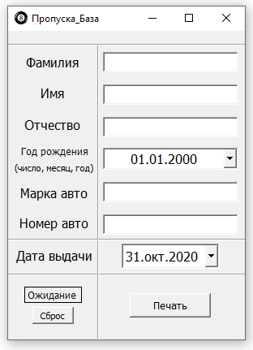

# Программа для печати пропусков

Автоматически заполняет нужные места в вордовском шаблоне и отправляет файл на печать в дефолтный принтер.

## Установка
* Установка программы не трубуется, надо просто запустить файл "Propuska_BAZA.exe".
* Путь к программе **не должен содержать кириллицу**.

## Работа программы:

1) Заполнять все поля не обязательно, на месте пустых полей просто ничего не напечатается.
2) Переключиться на следуещее заполняемое поле можно нажатием клавиши "Tab" или кликнув по нему мышкой.
3) После заполнения нужных полей нажать "Печать". 
Программа напечатает пропуск и надпись "Ожидание" (около кнопки "Сброс") изменится на "Завершено!".
4) Кнопка "Сброс" сбрасывает поля для заполнения. (её не обязательно нажимать, она просто помогает быстро сбросить поля).
